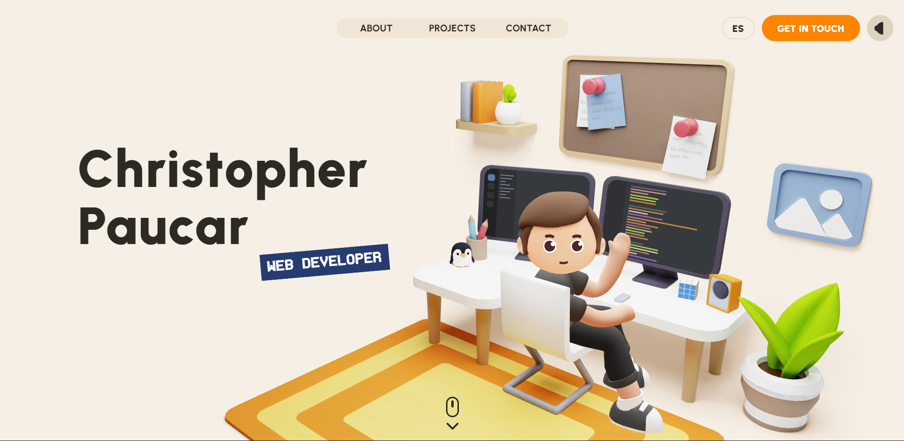

# Portfolio (2025)

Personal portfolio site: project case studies, lightweight 3D and shader demos, bilingual copy (English and German).

Built with **Vue 3**, **TypeScript**, and **Vite**. Motion via **GSAP** and **Lenis**, 3D via **three.js**, audio via **Howler**. GLSL is compiled through **vite-plugin-glsl**.

## Scripts

| Command        | Description                          |
| -------------- | ------------------------------------ |
| `npm run dev`   | Dev server on port **3000** (`strictPort`) |
| `npm run build` | `vue-tsc` then production bundle to `dist/` |
| `npm run preview` | Serve the production build locally |
| `npm run typecheck` | Typecheck only (`vue-tsc -b`) |

## Contact Modal (mail icon)

- The mail icon now opens a modal form (instead of `mailto`) and sends data to `POST /api/contact`.
- Backend handler lives in `api/contact.js` and uses **Nodemailer**.
- Configure SMTP credentials in your environment (see `.env.example`).

Required environment variables:

- `SMTP_USER`
- `SMTP_PASS`

Recommended variables:

- `VITE_CONTACT_API_URL` (optional, defaults to `/api/contact`)
- `VITE_CONTACT_EMAIL` (email shown/used for mail contact entry)
- `SMTP_HOST`
- `SMTP_PORT`
- `SMTP_SECURE`
- `MAIL_FROM`
- `MAIL_TO`

## Content

- **Projects**: `src/content/projects/{en,de}/<slug>.ts` — copy, tags, media, links. Slugs must align with `projectIds` in `src/content/projects/index.ts`.
- **Previews / listing**: `src/content/projects/previews/`.
- **Tags**: variants and labels live in `src/components/tagVariants.ts` (used by `Tag.vue` and content types).

## Stack (high level)

- Vue 3 (`<script setup>`), SCSS with shared mixins (`src/assets/styles/`)
- i18n helpers under `src/i18n/`
- WebGL / GLSL under `src/three/` where applicable

## Credits & Attribution

This project was created and designed by Christopher Paucar.

If you use this project or substantial parts of its source code as a base for your own portfolio or work, attribution must be preserved.

Please keep:

- existing credit comments in the source code
- this attribution section in the README
- a visible reference to the original project/repository in derivative works

Original portfolio:
-> https://david-hckh.com

Commercial reuse or redistribution of substantial portions of this project without permission is prohibited.
